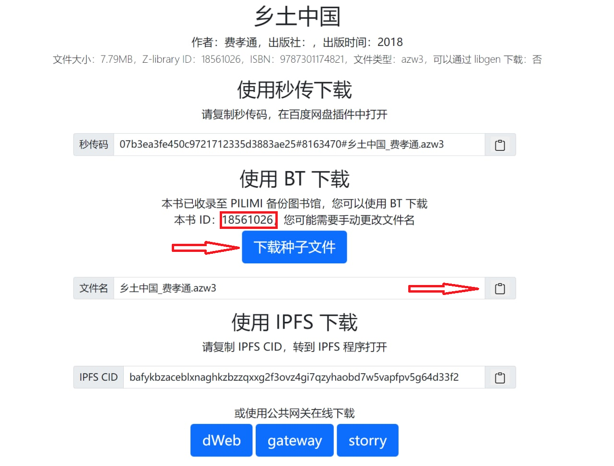
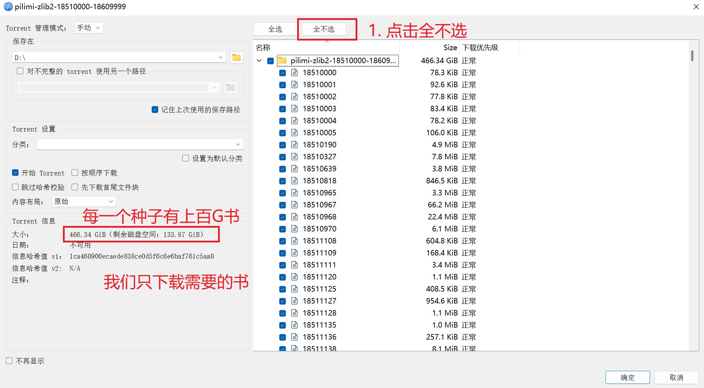
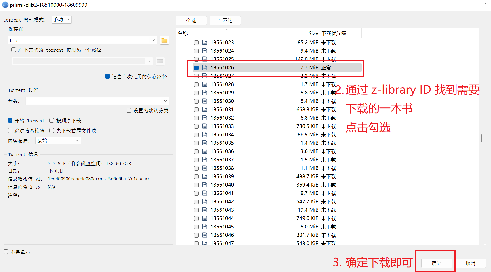

## 从 zhelper V5 中获取信息

如图所示，请在搜索结果界面，复制保存文件名、“本书ID”，下载种子文件备用。

 

## BT 简明教程

以 qbittorrent 为例介绍 BT 下载方法。

首先在[官网](https://www.qbittorrent.org/)下载 BT 软件。安装。

将下载好的种子文件直接拖入 qbittorrent 软件界面，将会弹出以下窗口：

 

 

下载过程可能需要比较长一段时间。在下载完成之后，需要手动更改文件名。然后直接打开即可。

