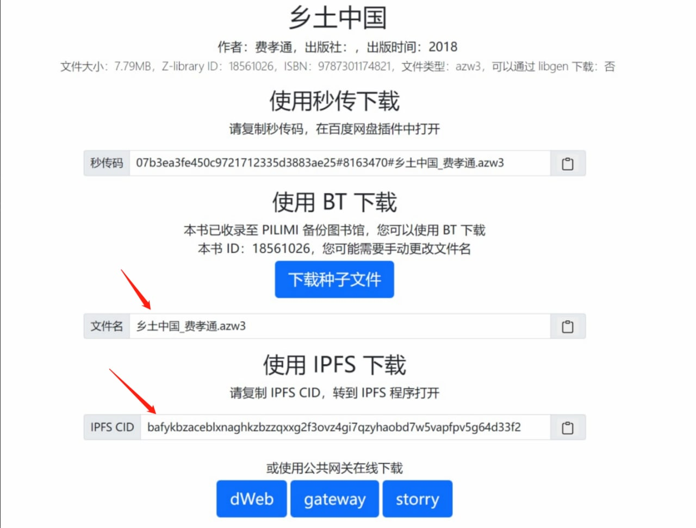
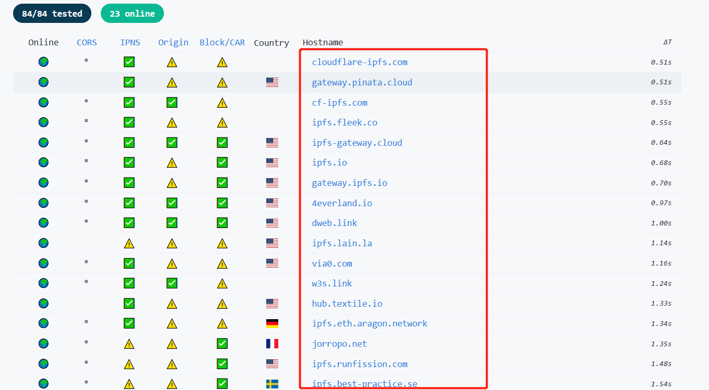
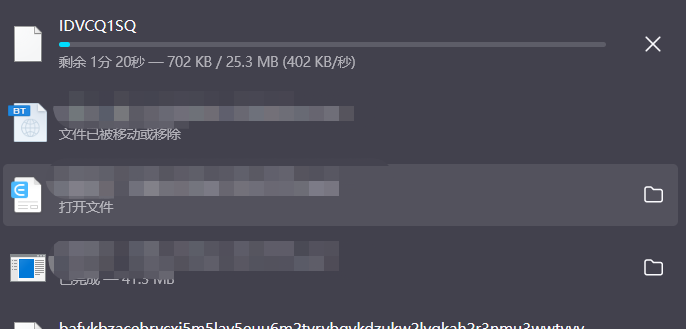
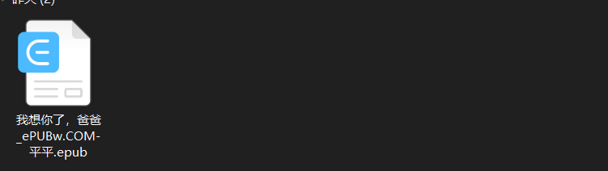

!!! tip "说明"

    本文将介绍关于 IPFS 下载方式的进阶内容。**如果您只是想简单体验 IPFS 下载，请直接在 V5 中选择“使用公共网关”**


## 从 zhelper V5 中获取信息

如图所示，请在搜索结果界面，复制保存文件名和 IPFS CID 备用。

 

## 手动选择公共网关

去这里[Public Gateway Checker | IPFS](https://ipfs.github.io/public-gateway-checker/) 找到可用网关，可用网关即如下标出的域名地址



随便找一个地址，我这里找的是`https://4everland.io/`

然后在该地址后面追加`ipfs/bafykbzacebrvcxi5m5lay5euu6m2tvrybgvkdzukw2lyqkah2r3nmu3wwtvvy`

这里的`bafykbzacebrvcxi5m5lay5euu6m2tvrybgvkdzukw2lyqkah2r3nmu3wwtvvy`就是之前复制的图书IPFS CID码

拼接后的地址如下所示

```
https://4everland.io/ipfs/bafykbzacebrvcxi5m5lay5euu6m2tvrybgvkdzukw2lyqkah2r3nmu3wwtvvy
```

将地址复制到浏览器地址栏中访问，即可下载图书，此时的图书文件是个IDVCQ1SQ文件



下载完成后将下载的IDVCQ1SQ文件改名为如下图所示即可打开（文件名可以参考 V5 界面给出的文件名）




<!-- ## 使用 IPFS Desktop

参考 [官方文档](https://docs.ipfs.tech/install/ipfs-desktop/) 下载 IPFS Desktop。
 -->

