!!! tip "说明"

    本文将介绍关于秒传下载的使用教程。秒传工具分为网页版和插件版。后者成功率较高，但是目前**大部分电脑浏览器和小部分安卓浏览器**支持秒传插件，**苹果浏览器不支持**。下面将对二者进行介绍。

## 从 zhelper V5 中获取信息

如图所示，请在搜索结果界面，复制保存秒传码备用。

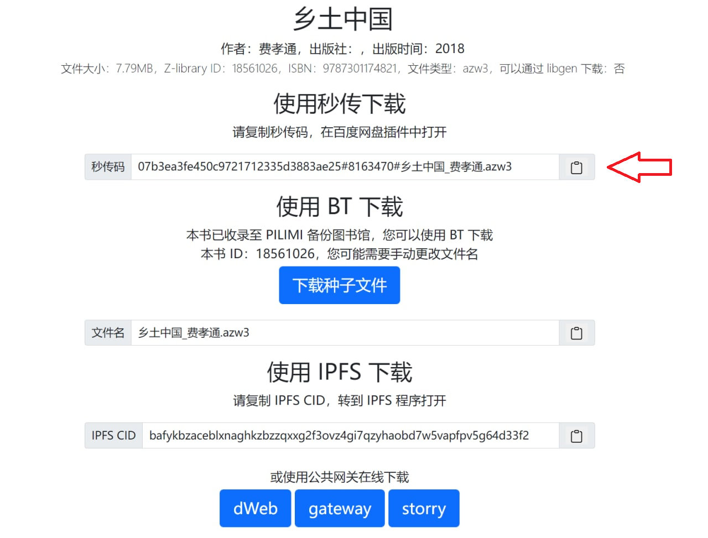 


## 使用网页下载

**首先登录百度网盘**：https://pan.baidu.com/


秒传网站链接：https://mengzonefire.github.io/baidupan-rapidupload/

打开之后，粘贴链接，上面两个都可以留空。

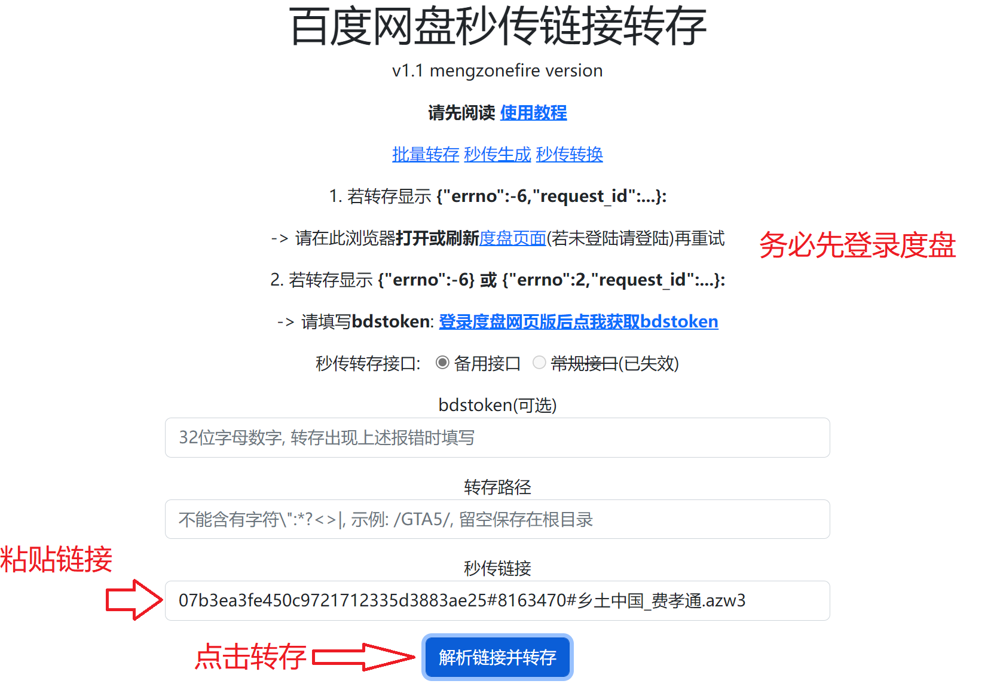 

点击之后会弹出一个页面，里面有一串代码，我们只要看到有`"errno":0`这个符号就说明秒传成功了。如果`"errno"`后面不是0，请按照秒传网站上的教程来排查错误。

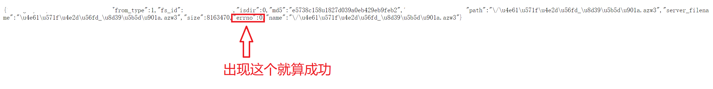 

文件一般是直接存在度盘首页。

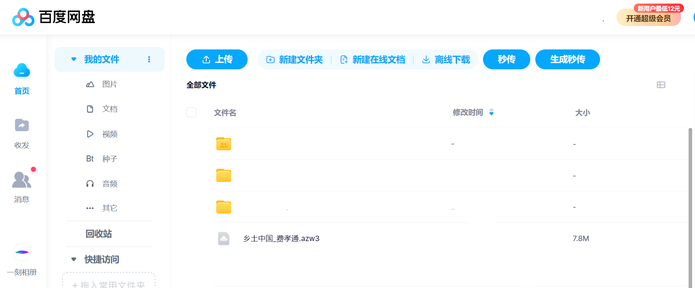 

如果转存失败，请尝试使用其他秒传码。

1. 几种弹窗提示代码 "errno" (错误码) 及解决方法：
```
{"errno":0} - 转存成功，文件已存到网盘根目录，请刷新网盘查看（点击查看成功示例）
{"errno":2} - 转存失败，请重新打开或刷新度盘页面后重试（若未登陆请登陆）
{"errno":-6} - 转存失败，请重新打开或刷新度盘页面后重试（若未登陆请登陆）
{"errno":-7} - 转存路径含有非法字符 " : * ? < > |
{"errno":-8} - 网盘里已存在同名文件/文件夹，请打开网盘查找
{"errno":-10} - 网盘容量已满
```
2. 如需要下载，目标文件应存在于百度网盘，若百度网盘官方服务器内无此文件，将转存失败。
3. **也有可能是网页版不好用，请使用插件下载**

## 使用插件下载

这里以Windows端的火狐浏览器为例，Edge、Kiwi 版参考 [ssdown](https://ssdown.org/blog/miaochuan/)；

打开[秒传链接提取脚本文档](https://mengzonefire.code.misakanet.cn/rapid-upload-userscript-doc/document/Install/Windows.html#%E5%AE%89%E8%A3%85%E6%B5%8F%E8%A7%88%E5%99%A8)，我已经提前安装好了火狐浏览器，如何安装火狐浏览器请百度这里不在叙述，这里点击左边侧边栏的Windows端，然后点击右边的火狐商店。

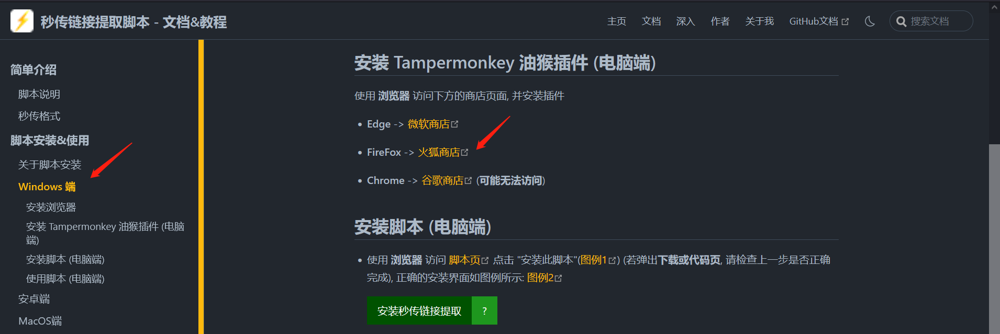

点击添加到Firefox

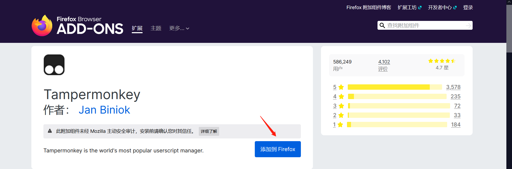

这时会询问是否添加，选择添加

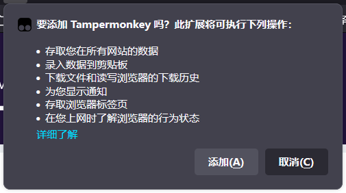

回到刚才的页面，选择安装秒传链接提取

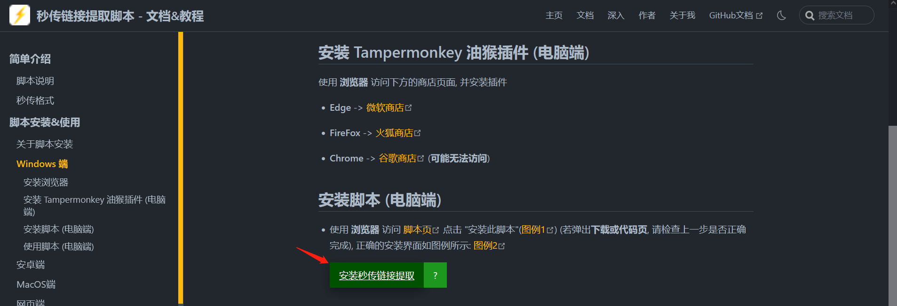

点击安装

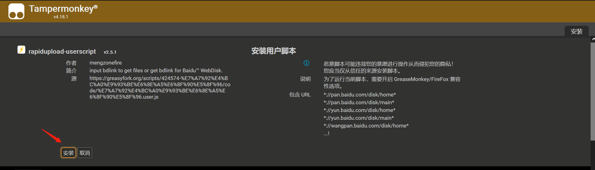

这时脚本已经安装好了。

使用浏览器打开百度网盘页面，点击秒传

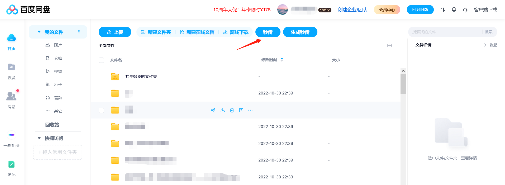

将我们复制的秒传码粘贴进去，点击确定（下面使用的是另外一个秒传码 🤣，不影响）：

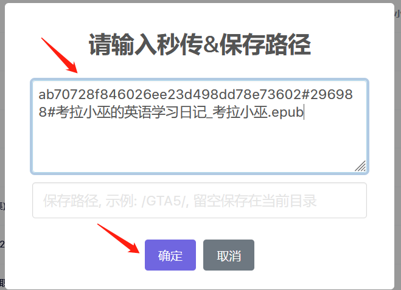

提示转存成功，点击确定


此时书已经在网盘里了

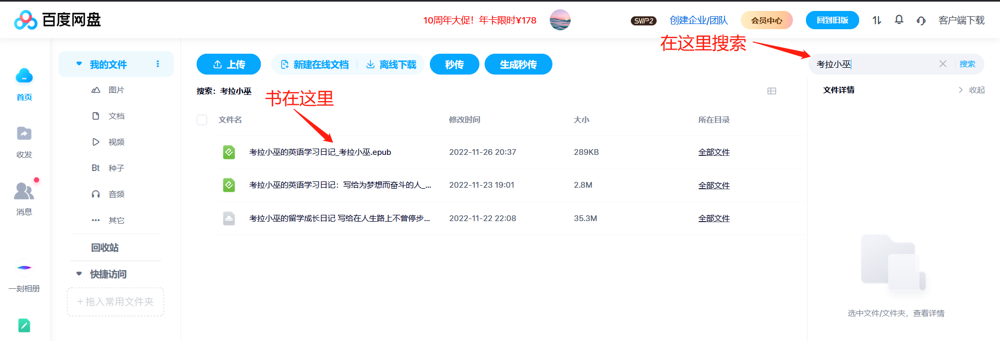

如果转存失败，请尝试使用其他秒传码。

