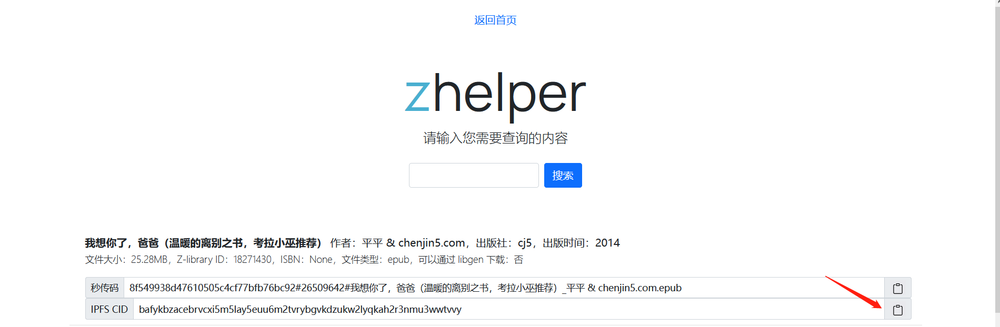
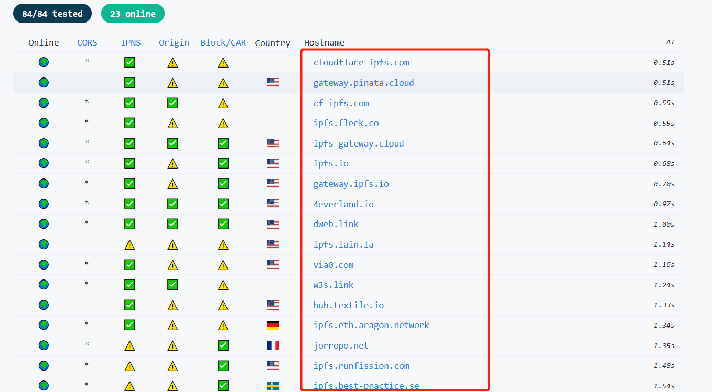
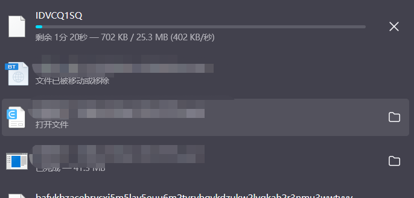

点击复制搜索的图书的IPFS CID码



去这里[Public Gateway Checker | IPFS](https://ipfs.github.io/public-gateway-checker/) 找到可用网关，可用网关即如下标出的域名地址



随便找一个地址，我这里找的是`https://4everland.io/`

然后在该地址后面追加`ipfs/bafykbzacebrvcxi5m5lay5euu6m2tvrybgvkdzukw2lyqkah2r3nmu3wwtvvy`

这里的`bafykbzacebrvcxi5m5lay5euu6m2tvrybgvkdzukw2lyqkah2r3nmu3wwtvvy`就是之前复制的图书IPFS CID码

拼接后的地址如下所示

```
https://4everland.io/ipfs/bafykbzacebrvcxi5m5lay5euu6m2tvrybgvkdzukw2lyqkah2r3nmu3wwtvvy
```

将地址复制到浏览器地址栏中访问，即可下载图书，此时的图书文件是个IDVCQ1SQ文件



下载完成后将下载的IDVCQ1SQ文件改名为如下图所示即可打开


### 1.3 参考资料

https://bbs.yibook.org/d/395-hui-fu-xia-zai-fang-shi-11-shi-yong-ipfs-xia-zai