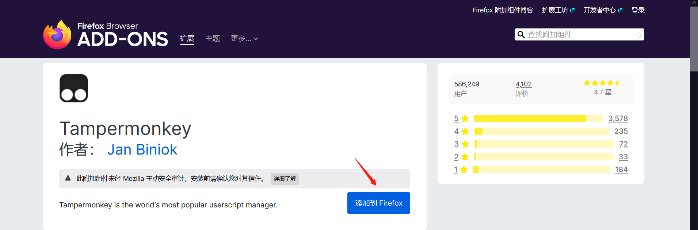

这里以Windows端的火狐浏览器为例；

打开[秒传链接提取脚本文档](https://mengzonefire.code.misakanet.cn/rapid-upload-userscript-doc/document/Install/Windows.html#%E5%AE%89%E8%A3%85%E6%B5%8F%E8%A7%88%E5%99%A8)，我已经提前安装好了火狐浏览器，如何安装火狐浏览器请百度这里不在叙述，这里点击左边侧边栏的Windows端，然后点击右边的火狐商店。

点击添加到Firefox

这时会询问是否添加，选择添加

回到刚才的页面，选择安装秒传链接提取

点击安装

这时脚本已经安装好了。

#### 1.1.2 下载图书

访问网站：https://v5.zhelper.net/

在输入框中输入你想找的书名或作者，这里以作者考拉小巫为例，然后点击搜索

点击复制秒传码

使用浏览器打开百度网盘页面，点击秒传

将我们复制的秒传码粘贴进去，点击确定

提示转存成功，点击确定

此时书已经在网盘里了

如果转存失败，请尝试使用其他秒传码。