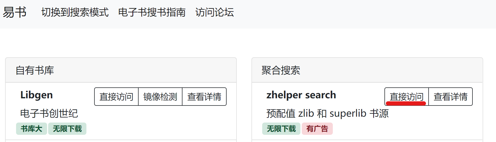
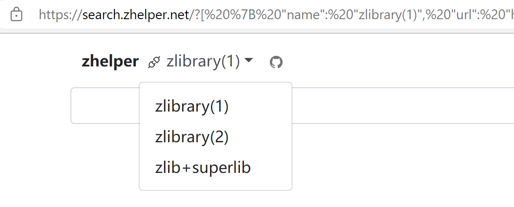
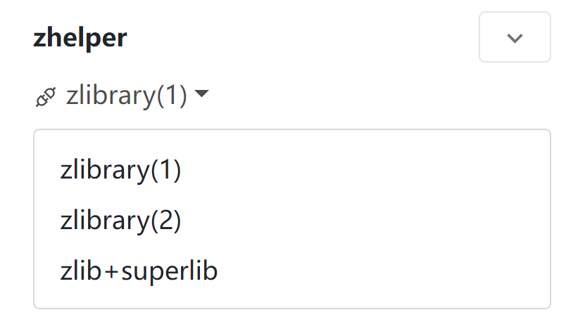
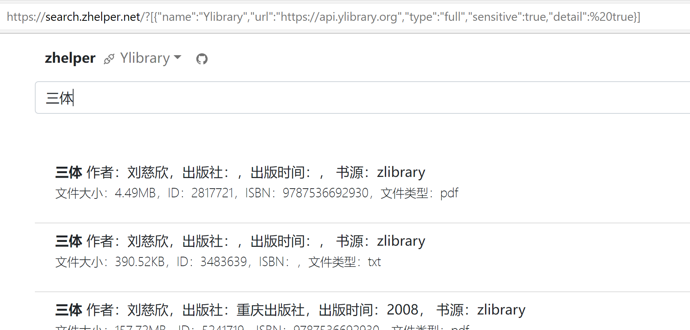

zhelper search 的地址是：https://search.zhelper.net/

但是直接打开会显示：

 

这是由于你没有设置后端接口。

## 自动配置接口（建议）

参考易书网站提供的工具：https://tool.yibook.org/

<!-- 您可以在易书论坛或者易书导航等网站找到预先配置好的链接地址。直接访问即可。

以易书导航为例，首先打开[网站](https://nav.yibook.org/)（网址：https://nav.yibook.org/），找到 zhelper search 然后选择“直接访问”，如下图所示：

 

打开，选择书源即可。

 


手机版点击右上角展开再选择。

  -->

## 手动配置接口（进阶）

已移除，自行研究

<!-- 
以 Ylibrary 接口为例，首先[访问 Ylibrary 网站](https://ylibrary.org/blog/2022/12/23/%E5%85%B3%E4%BA%8E%E5%85%B3%E9%97%AD%E6%90%9C%E7%B4%A2%E9%A1%B5%E9%9D%A2%E7%9A%84%E8%AF%B4%E6%98%8E/)，复制里面的配置文件，如下所示：

```
{"name":"Ylibrary","url":"https://api.ylibrary.org","type":"full","sensitive":true,"detail": true}
```

然后在浏览器地址栏，手动输入 `https://search.zhelper.net/?[{"name":"Ylibrary","url":"https://api.ylibrary.org","type":"full","sensitive":true,"detail": true}]`。注意这里加入了 `?[配置文件]` 这一段，实际上就是告诉 zhelper search 用哪个搜索接口。如果有多个配置文件，请用 `?[配置文件1,配置文件2]` 的形式录入。

刷新一下，就可以看到搜索接口出现了。

 
 -->
