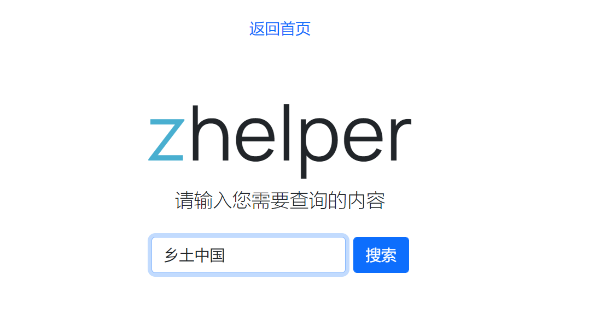
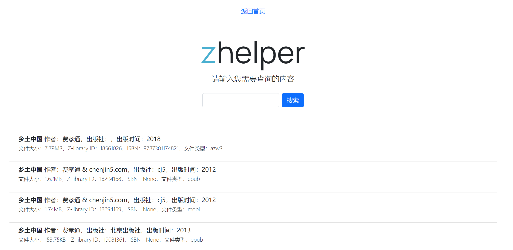
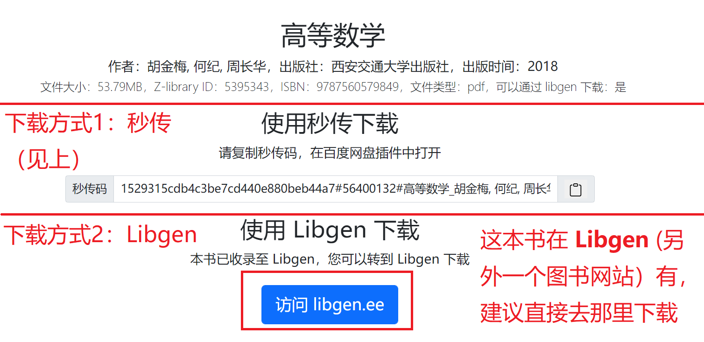

zhelper V5 网页链接：https://node1.v5.zhelper.net/

## 搜索

输入关键词，点击搜索。关键词支持：ISBN（不一定能搜到）、作者、出版社、书名。

 

搜索结果展示界面，每一页展示 20 条结果，拉到最下面可以往后翻页。每个搜素结果都可以直接点击。

 

## 下载

!!! tip "说明"

    zhelper 不存储任何书籍，zhelper 只是一个搜索工具，数据来自于互联网公开信息，zhelper仅仅只是提供索引。以下教程将帮助您从**去中心化文件分享网络**中获取资源

下载详情界面有两种不同版本

### 第一种版本

第一种版本有三种下载方式。

- 使用秒传下载，[详细教程](/mc)
- 使用BT下载，[详细教程](/bt)
- 使用IPFS下载，[详细教程](/ipfs)

 

### 第二种版本

第二种版本有两种下载方式。

- 使用秒传下载，[详细教程](/mc)
- 使用 Libgen 下载，[详细教程](https://bbs.yibook.org/d/391-hui-fu-xia-zai-fang-shi-9-jie-zhu-libgen-ti-dai-xia-zai)

 